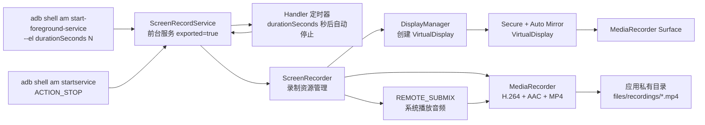

# Android 13 系统应用录屏方案（ADB 控制前台服务版）

## 1. 目标

在已获得设备授权的 Android 13 开发板上，以系统分区预装、UID 1000、platform certificate 匹配的系统应用实现屏幕录制。应用以 Android 前台服务形态运行，录制默认显示上正在播放视频的其他应用画面，由 ADB 命令控制开始和结束：

- 录制应用自身不启动 Activity 遮挡目标视频，不作为录制入口；
- 录制内容为默认显示的最终合成画面，目标视频应用保持前台即可被录到；
- 不使用普通 MediaProjection 用户授权流程；
- 不调用 `createScreenCaptureIntent()`；
- 录制视频使用 H.264 编码和 MP4 封装；
- 录制系统播放音频，不使用麦克风替代；
- START 命令必须携带录制时长（秒），到达时长后自动停止；
- 支持独立 STOP 命令手动停止；
- 首版针对普通 `FLAG_SECURE` 窗口；
- 首版不修改 system_server、WMS、SurfaceFlinger、AudioPolicy 或 SELinux 源码；
- 输出文件保存到应用私有目录；
- 不承诺读取 Widevine L1、DRM、secure codec 或 TEE protected buffer 内容。

设备前提由系统集成侧保证：

- Android SDK/API 33 运行环境；
- APK 可预装到 `/system/priv-app` 或等价系统分区；
- APK 实际运行 UID 为 1000；
- APK 使用与开发板一致的 platform certificate 签名；
- 已授予 `CAPTURE_SECURE_VIDEO_OUTPUT`；
- 已授予 `CAPTURE_VIDEO_OUTPUT`；
- 已授予 `CAPTURE_AUDIO_OUTPUT`；
- 已授予 `ACCESS_SURFACE_FLINGER`；
- SELinux 为 permissive；
- 设备可通过 root ADB 执行命令（ADB 为正式控制面）。

## 2. 总体架构



控制面：

`adb shell am start-foreground-service`（START，含时长）→ `ScreenRecordService` → 前台通知 → 初始化录制 → 定时器或 STOP action → 封装 MP4 → 释放资源 → 停止服务。

`MainActivity` 不作为录制入口，只提供可选状态展示；ADB 是正式接口。

`class-13.jar` 仅作为 Android 13 framework JAR 参与编译，不打包到 APK，也不改变运行时 UID、权限、Binder 授权或 SELinux 策略。

## 3. ADB 命令接口

### 3.1 action 定义

| action | 用途 |
|---|---|
| `com.xros.securescreenrecord.action.START` | 开始录制 |
| `com.xros.securescreenrecord.action.STOP` | 停止录制 |
| `com.xros.securescreenrecord.action.STATUS` | 查询状态（可选） |

所有命令必须指定 `--user 0` 和完整组件名，避免隐式解析错误。

### 3.2 开始录制

```bash
adb shell am start-foreground-service  -n com.xros.securescreenrecord/.service.ScreenRecordService -a com.xros.securescreenrecord.action.START --el durationSeconds 30 --es outputFileName my_recording.mp4
```

- 必须使用 `am start-foreground-service`，确保入口按前台服务语义启动；
- `durationSeconds` 类型为 long，单位为秒；
- 有效范围 1–7,200 秒（最长 2 小时）；
- 不支持无限录制模式；
- 缺失、零、负数、溢出或超过上限时拒绝启动并记录原因。

### 3.3 停止录制

```bash
adb shell am startservice -n com.xros.securescreenrecord/.service.ScreenRecordService -a com.xros.securescreenrecord.action.STOP
```

- STOP action 忽略时长参数；
- 正常停止必须使用 STOP action，不使用 `am force-stop`，否则 MP4 尾部封装可能未完成。

### 3.4 查询状态

```bash
adb shell dumpsys activity service com.xros.securescreenrecord/.service.ScreenRecordService
```

Service 实现 `dump()`，输出当前状态、会话开始时间、截止时间、停止原因、输出文件和最近错误。

### 3.5 紧急停止（非常规）

```bash
adb shell am stopservice --user 0 \
  -n com.xros.securescreenrecord/.service.ScreenRecordService
```

仅作为紧急手段；正常流程使用 STOP action。

## 4. 录制目标与前台约束

- 应用以 `ScreenRecordService` 运行，录制默认显示的最终合成画面；
- 目标视频应用保持前台播放，录制应用不显示 Activity；
- ADB 启动服务不会拉起 `MainActivity`；
- `android:stopWithTask` 不启用，Activity 退出不影响录制服务；
- 首版不按包名隔离窗口，目标为默认显示上当前显示的画面。

## 5. 录制方案决策

### 5.1 屏幕视频

使用 `MediaRecorder` 的 surface 输入模式：

- `setVideoSource(MediaRecorder.VideoSource.SURFACE)`；
- `setOutputFormat(MediaRecorder.OutputFormat.MPEG_4)`；
- `setVideoEncoder(MediaRecorder.VideoEncoder.H264)`；
- 配置实际显示宽度和高度（调整为偶数尺寸）；
- 默认 30 FPS；
- 默认约 8 Mbps 视频码率；
- `prepare()` 后取得 `getSurface()`。

创建虚拟显示，使用以下 flags：

- `VIRTUAL_DISPLAY_FLAG_PUBLIC`；
- `VIRTUAL_DISPLAY_FLAG_SECURE`；
- `VIRTUAL_DISPLAY_FLAG_AUTO_MIRROR`。

不要设置 `VIRTUAL_DISPLAY_FLAG_OWN_CONTENT_ONLY`，否则虚拟显示不会镜像目标显示内容。

虚拟显示的输出 surface 设置为 `MediaRecorder.getSurface()`，最后调用 `MediaRecorder.start()`。

### 5.2 系统音频

首选直接使用 `MediaRecorder` 的系统音频源：

- `MediaRecorder.AudioSource.REMOTE_SUBMIX`；
- AAC 编码；
- 48 kHz 采样率；
- 立体声或设备支持的声道数；
- 默认约 128 kbps 音频码率。

`RECORD_AUDIO` 代表麦克风权限，不能作为系统播放音频权限的替代。`REMOTE_SUBMIX` 初始化失败时，应将录制标记为失败并记录 AudioPolicy/权限错误，不自动切换到麦克风。

`REMOTE_SUBMIX` 采集系统允许输出的混音，不保证只包含目标视频应用的音频；如需按应用隔离音频，需另行设计 AudioPolicy/AudioPlaybackCapture 方案。

### 5.3 MediaProjection

不实现普通 MediaProjection 授权流程：

- 不调用 `MediaProjectionManager.createScreenCaptureIntent()`；
- 不等待用户确认；
- 不生成伪造 projection token；
- 不把普通 MediaProjection token 当作 secure-video token。

在已具备 UID 1000 和系统捕获权限的设备上，首版直接走 DisplayManager 的系统权限路径。

### 5.4 SurfaceControl 备用路径

首版不直接使用：

- `SurfaceControl.captureDisplay()`；
- `SurfaceControl.captureLayers()`；
- `CaptureArgs.setCaptureSecureLayers()`；
- WMS 内部 `ContentRecorder`。

这些 API 虽然可以通过 Android 13 framework JAR 解析或调用，但最终仍由服务端权限和 SurfaceFlinger 决定。只有 DisplayManager 路径在目标 ROM 上明确失败，且日志证明需要低层 display token 操作时，才增加独立的 `SurfaceControl` 适配层。

## 6. 时长与定时停止

### 6.1 时长语义

- `durationSeconds` 为 START 必需参数，单位秒；
- 有效范围 1–7,200 秒（最长 2 小时）；
- 录制计时从 `MediaRecorder.start()` 成功时开始，而不是 ADB 命令到达时开始；
- 达到时长后服务自动停止。

### 6.2 自动停止

- 在 `MediaRecorder.start()` 成功后，基于 `SystemClock.elapsedRealtime()` 调度 Handler 定时器；
- 定时器到期调用统一的 `requestStop(reason=AUTO_DURATION)`；
- 可设置 `MediaRecorder.setMaxDuration()` 作为底层安全上限，但只作为辅助机制，实际生命周期由服务定时器控制；
- `MEDIA_RECORDER_INFO_MAX_DURATION_REACHED` 事件也必须汇聚到同一个幂等停止流程，避免重复 stop。

### 6.3 停止来源

| 停止来源 | 触发 |
|---|---|
| `AUTO_DURATION` | 定时器到期 |
| `EXTERNAL_COMMAND` | ADB STOP action |
| `MEDIA_RECORDER_ERROR` | 编码器错误事件 |
| `SERVICE_DESTROYED` | 服务销毁 |

所有停止请求统一进入幂等的 `requestStop()`：

- 第一次请求执行实际停止；
- 后续请求只记录重复停止日志；
- `STARTING` 阶段收到 STOP 时取消初始化并释放资源；
- STOP 不会覆盖正在进行的录制；
- 重复 START 返回 busy，不创建第二个实例。

## 7. 工程文件规划

### 7.1 现有文件修改

| 文件 | 修改内容 |
|---|---|
| `app/build.gradle.kts` | 配置 Android 13 framework JAR 的 `compileOnly`、platform 签名和外部参数 |
| `app/src/main/AndroidManifest.xml` | system shared UID、系统权限、导出录制服务、控制权限和前台服务类型 |
| `app/src/main/java/com/xros/securescreenrecord/MainActivity.kt` | 可选状态展示，不作为录制入口 |
| `app/src/main/res/layout/activity_main.xml` | 可选状态界面 |
| `app/src/main/res/values/strings.xml` | 通知、状态和错误文本 |
| `app/src/main/keepRules/rules.keep` | 首版无需宽泛规则；后续使用反射时再增加精确 keep 规则 |

### 7.2 新增文件

| 文件 | 职责 |
|---|---|
| `app/src/main/java/com/xros/securescreenrecord/recording/RecordingConfig.kt` | 分辨率、码率、帧率、音频、时长和输出路径配置 |
| `app/src/main/java/com/xros/securescreenrecord/recording/ScreenRecorder.kt` | MediaRecorder、VirtualDisplay 和资源生命周期管理 |
| `app/src/main/java/com/xros/securescreenrecord/service/ScreenRecordService.kt` | ADB action、前台通知、时长解析、串行命令和服务生命周期 |
| `app/src/main/java/com/xros/securescreenrecord/recording/RecordingState.kt` | 录制状态、停止原因和失败原因定义 |
| `app/src/main/java/com/xros/securescreenrecord/diagnostic/RecordingDiagnostics.kt` | UID、权限、显示、音频和编码阶段日志 |

首版不拆分手写 `VideoEncoder`、`AudioEncoder`、`MediaMuxerWrapper`。由 `MediaRecorder` 完成编码和 MP4 封装，减少音视频同步和 buffer 生命周期问题。

## 8. 构建配置

### 8.1 framework JAR

在 `app/build.gradle.kts` 中增加外部路径配置，推荐通过 Gradle property 传入：

- 属性名：`android13FrameworkJar`；
- 只配置为 `compileOnly(files(...))`；
- 不复制到 `app/libs` 后随 APK 发布；
- 不将 JAR 提交到仓库；
- 不把路径写入自动生成的 `local.properties`。

当前工程保留 `compileSdk = 36.1` 以兼容现有 AndroidX，但业务代码必须限制在 Android 13 可用 API 范围内。

### 8.2 platform 签名

增加独立的系统签名构建类型：

- keystore 路径来自环境变量或用户级 Gradle properties；
- key alias 来自外部配置；
- 密码不写入仓库；
- 构建后使用签名工具核对证书摘要；
- 证书必须与开发板当前 platform certificate 完全一致。

## 9. Manifest 设计

应用声明：

- `android:sharedUserId="android.uid.system"`；
- `android:allowBackup` 按产品要求决定；
- 主 Activity 保留导出以便从 Launcher 启动，但不作为录制入口；
- `ScreenRecordService` 设置为 `android:exported="true"`，以便接收 ADB 命令；
- 使用自定义 signature 级权限保护服务（例如 `com.xros.securescreenrecord.permission.CONTROL_RECORDING`）；
- 服务设置 `android:foregroundServiceType="mediaProjection"`；
- 服务不设置 `stopWithTask="true"`，录制独立于 Activity 生命周期。

权限声明：

- `android.permission.CAPTURE_SECURE_VIDEO_OUTPUT`；
- `android.permission.CAPTURE_VIDEO_OUTPUT`；
- `android.permission.CAPTURE_AUDIO_OUTPUT`；
- `android.permission.ACCESS_SURFACE_FLINGER`；
- `android.permission.FOREGROUND_SERVICE`。

这些声明只表达 APK 的请求能力，实际是否 granted 仍由系统 PackageManager、预装位置、签名和系统权限配置决定。

root ADB shell 可直接启动服务；若未来要求普通非 root shell 控制，需要在系统镜像中向 shell 授予控制权限，不能由 APK 自行完成。

## 10. `RecordingConfig` 设计

建议字段：

- `displayId`：默认 `Display.DEFAULT_DISPLAY`；
- `width`、`height`：从默认显示 metrics 读取，调整为偶数尺寸；
- `densityDpi`：从默认显示 metrics 读取；
- `videoFrameRate`：默认 30；
- `videoBitrate`：默认 8 Mbps；
- `audioSampleRate`：默认 48 kHz；
- `audioChannelCount`：默认 2；
- `audioBitrate`：默认 128 kbps；
- `durationSeconds`：来自 ADB START 参数，1–7,200（最长 2 小时）；
- `outputDirectory`：`filesDir/recordings`；
- `outputFileName`：使用时间戳生成，避免覆盖已有文件。

首版固定录制默认显示，不处理多显示器和旋转期间的无缝切换。

## 11. `ScreenRecordService` 生命周期

### 11.1 服务职责

- 接收 `ACTION_START`、`ACTION_STOP` 和 `ACTION_STATUS`；
- 解析并校验 `durationSeconds`；
- 启动后立即调用 `startForeground()`，不等待录制初始化完成；
- 前台服务类型使用 `FOREGROUND_SERVICE_TYPE_MEDIA_PROJECTION`；
- 在专用 HandlerThread 上串行执行录制初始化、停止和释放；
- 使用 Handler 定时器实现自动停止；
- 实现 `dump()` 输出诊断信息；
- 返回 `START_NOT_STICKY`，避免异常退出后自动生成新的残缺文件。

### 11.2 START 流程

1. 解析并校验 `durationSeconds`，无效则拒绝；
2. 立即调用 `startForeground()` 并发布常驻通知；
3. 投递录制初始化到 HandlerThread；
4. `MediaRecorder.start()` 成功后记录 `elapsedRealtime` 起点；
5. 调度定时器（`durationSeconds` 秒后自动停止）；
6. 进入 `RECORDING` 状态。

### 11.3 停止流程

1. 取消定时器；
2. 调用 `MediaRecorder.stop()` 完成 MP4 封装；
3. 释放 VirtualDisplay、recorder surface 和 MediaRecorder；
4. 检查输出文件是否有效；
5. 更新通知为“录制完成”；
6. 调用 `stopForeground(STOP_FOREGROUND_REMOVE)` 和 `stopSelf()`。

### 11.4 状态机

`IDLE` → `STARTING` → `RECORDING` → `STOPPING` → `STOPPED`

失败状态：

`STARTING` 或 `RECORDING` → `FAILED`

状态转换只在串行工作线程执行；状态通过日志、通知和 `dump()` 暴露。

## 12. `ScreenRecorder` 生命周期

### 12.1 启动顺序

1. 检查当前状态是否为 `IDLE`。
2. 获取默认显示和实际 metrics。
3. 创建应用私有输出目录。
4. 创建输出文件。
5. 创建 `MediaRecorder`。
6. 配置 `REMOTE_SUBMIX`、AAC、H.264、MP4 和录制参数。
7. 调用 `prepare()`。
8. 获取 recorder surface。
9. 调用 `DisplayManager.createVirtualDisplay()`。
10. 将虚拟显示 surface 连接到 recorder surface。
11. 调用 `MediaRecorder.start()`。
12. 状态切换为 `RECORDING`。

### 12.2 停止顺序

1. 状态切换为 `STOPPING`。
2. 停止虚拟显示内容输出。
3. 调用 `MediaRecorder.stop()`。
4. 释放 `VirtualDisplay`。
5. 释放 recorder surface。
6. 调用 `MediaRecorder.reset()` 或 `release()`。
7. 检查输出文件是否存在且大小大于零。
8. 状态切换为 `STOPPED`。

由于录制时间过短时 `MediaRecorder.stop()` 可能失败，停止异常需要单独记录，并删除不完整文件或将其标记为无效文件。

### 12.3 资源释放

必须覆盖：

- `VirtualDisplay.release()`；
- recorder surface；
- `MediaRecorder.release()`；
- Handler 定时器；
- 后台工作线程；
- 当前输出文件引用；
- 失败路径中的部分初始化资源。

`start()`、`stop()`、`release()` 必须幂等，避免重复 ADB 命令造成多个 VirtualDisplay 或多个 MediaRecorder 实例。

## 13. 通知设计

频道：

- ID：`com.xros.securescreenrecord.recording`；
- 名称：“屏幕录制”；
- 重要性：低。

通知内容映射：

| 状态 | 标题 | 内容 |
|---|---|---|
| `STARTING` | 正在初始化 | 正在准备屏幕录制 |
| `RECORDING` | 正在录制屏幕 | 已录制时间 / 计划时长 |
| `STOPPING` | 正在保存 | 正在完成视频封装 |
| `STOPPED` | 录制完成 | 文件路径和大小 |
| `FAILED` | 录制失败 | 失败原因摘要 |

## 14. Activity 与界面设计

`MainActivity` 不作为录制入口，避免启动 Activity 遮挡正在播放的视频。

可显示：

- 当前服务状态；
- 最近一次输出文件；
- 最近一次错误摘要；
- “请使用 ADB 控制录制”提示。

不加入：

- MediaProjection 授权按钮；
- FLAG_SECURE 检测按钮；
- 麦克风回退选项；
- 多屏或 DRM 选项；
- 时长输入框作为正式控制入口。

## 15. 诊断设计

诊断日志用于定位系统集成问题，不改变录制行为，也不主动检查目标应用窗口的 `FLAG_SECURE` 状态。

启动时记录：

- `Process.myUid()`；
- `Build.VERSION.SDK_INT`；
- 当前 APK 的 `ApplicationInfo` 系统标志；
- 关键权限 `checkSelfPermission()` 结果；
- ADB action 和 `durationSeconds`；
- 默认显示 ID、宽高和密度；
- 虚拟显示 flags；
- MediaRecorder 配置阶段；
- `REMOTE_SUBMIX` 初始化阶段；
- `prepare()`、`start()`、`stop()` 结果；
- 录制起点和截止时间；
- 停止原因；
- 输出文件路径和文件大小；
- 异常类名、消息和堆栈。

`dump()` 输出会话状态，供 `dumpsys activity service` 查询。

错误分类：

| 错误 | 归类 |
|---|---|
| `SecurityException` | UID、签名、权限或 DisplayManager 检查失败 |
| `createVirtualDisplay()` 返回空 | DisplayManager/OEM 显示策略 |
| transaction 或 display surface 失败 | SurfaceFlinger 或显示 HAL |
| `REMOTE_SUBMIX` 初始化失败 | `CAPTURE_AUDIO_OUTPUT` 或 AudioPolicy |
| H.264/AAC 初始化失败 | 设备 MediaCodec/MediaRecorder 能力 |
| `stop()` 失败 | 录制时间过短或编码器未产生有效样本 |
| 输出文件不可写 | 应用目录或文件系统问题 |
| `durationSeconds` 无效 | ADB 参数错误 |

## 16. 测试和验收

### 16.1 构建验收

- release 构建成功；
- Kotlin、Manifest 和资源无错误；
- platform certificate 摘要正确；
- framework JAR 未进入 APK；
- Service、权限和 shared UID 出现在合并后的 Manifest 中。

### 16.2 设备安装验收

预装 APK 后确认：

- 安装路径位于系统分区；
- 应用 UID 为 1000；
- 应用具有系统应用/priv-app 标志；
- 四项关键捕获权限处于 granted；
- `ScreenRecordService` 已被系统识别；
- 进程实际 UID 与 PackageManager 记录一致。

### 16.3 服务与命令验收

- 执行 30 秒 START 命令，确认服务在初始化前已进入 foreground；
- 确认目标视频应用保持前台，录制应用未显示 Activity；
- 等待 30 秒，确认自动停止并生成有效 MP4；
- 启动 300 秒录制后发送 STOP，确认优雅停止、MP4 可播放、服务退出；
- 验证 `durationSeconds=7,200` 被接受、`durationSeconds=7,201` 被拒绝；完整 2 小时录制作为耐久性测试执行；
- 重复 START 被拒绝，不覆盖当前文件；
- STARTING 阶段发送 STOP，资源正确释放；
- 重复 STOP 和 STOP-before-START 不崩溃；
- `dumpsys activity service` 显示状态、时长、停止原因和输出文件。

### 16.4 视频验收

- 没有 MediaProjection 授权界面；
- VirtualDisplay 创建成功；
- 目标普通 `FLAG_SECURE` 视频内容进入视频；
- MP4 文件可生成；
- 视频轨存在；
- 视频编码为 H.264/AVC；
- 文件可以正常播放；
- 录制时长接近指定秒数。

### 16.5 音频验收

播放设备上的系统媒体声音，同时执行录制，确认：

- 音频轨存在；
- 音频编码为 AAC；
- 音频轨有有效样本；
- 录制内容来自系统播放音频；
- 麦克风未被作为失败回退源；
- 记录系统混音可能包含其他允许输出的声音。

### 16.6 异常恢复验收

- 短时录制（< 0.5 秒）`stop()` 失败时删除或标记无效文件；
- 录制期间 MediaRecorder error 事件触发停止并释放资源；
- 服务销毁、进程被杀后 VirtualDisplay、surface、MediaRecorder 和定时器均已释放；
- 磁盘满或输出目录不可写时捕获 IOException 并标记失败。

### 16.7 安全边界验收

本方案只对普通 secure layer 进行功能验收。以下内容不作为通过条件：

- Widevine L1；
- DRM protected surface；
- secure codec 输出；
- TEE protected buffer；
- 厂商自定义硬件保护路径。

## 17. 实施阶段

### Phase 1：构建、Manifest 和命令协议

- 配置 Android 13 framework JAR 的 compile-only 路径；
- 配置 platform 签名；
- 添加 shared UID、系统权限、导出录制服务和控制权限；
- 确定 ADB action 与 `durationSeconds` 参数；
- 完成最小 Service 壳；
- 完成构建验证。

### Phase 2：前台服务与定时录制

- 新增 `RecordingConfig`；
- 新增 `RecordingState`；
- 新增 `ScreenRecordService`；
- 实现 `startForeground()`、串行 HandlerThread 和 Handler 定时器；
- 实现 START/STOP 幂等处理；
- 完成 ADB 命令和时长控制验收。

### Phase 3：视频录制

- 新增 `ScreenRecorder`；
- 接入 H.264/MP4；
- 接入 secure auto-mirror VirtualDisplay；
- 完成无音频视频验收。

### Phase 4：系统音频

- 接入 `REMOTE_SUBMIX`；
- 接入 AAC 参数；
- 验证音视频同步；
- 明确处理 AudioPolicy 失败；
- 完成音视频 MP4 验收。

### Phase 5：诊断和界面

- 新增 `RecordingDiagnostics`；
- 实现 `ScreenRecordService.dump()`；
- 更新 Activity 为可选状态页面；
- 补齐通知和状态文本；
- 完成异常清理和重复命令保护。

### Phase 6：设备集成验收

- 预装 platform 签名 APK；
- 复核 UID 和权限；
- 使用 ADB 录制普通 `FLAG_SECURE` 视频内容；
- 复核 H.264/AAC MP4；
- 验证自动停止、手动停止和异常恢复；
- 根据 logcat 和 dumpsys 处理 OEM 差异。

## 18. 明确不采用的方案

1. 不使用普通 MediaProjection 用户授权。
2. 不通过反射伪造 `MediaProjection` 或 `IMediaProjection` token。
3. 不把 `class-13.jar` 当作运行时权限来源。
4. 不使用 `RECORD_AUDIO` 代替系统音频。
5. 不在音频失败时切换麦克风。
6. 不首版引入手写 MediaCodec + MediaMuxer 复杂链路。
7. 不直接调用 WMS 内部 `ContentRecorder`。
8. 不承诺突破 DRM、Widevine 或硬件 protected buffer。
9. 不修改 system_server、SurfaceFlinger、AudioPolicy 或 SELinux 源码。
10. 不增加目标应用 `FLAG_SECURE` 验证功能。
11. 不支持无限录制模式。
12. 不支持通过 Activity 作为正式录制入口。
13. 不按包名隔离窗口或单独选择目标应用图层。

## 19. 交付结果

首版交付应包含：

- 可使用目标 platform certificate 构建的 APK；
- 系统分区预装所需的 Manifest 配置；
- 可通过 ADB 控制的 `ScreenRecordService`；
- 支持 `durationSeconds` 秒级时长的 START/STOP 命令；
- `ScreenRecorder`；
- `RecordingConfig`；
- 录制状态、停止原因和诊断日志；
- H.264/AAC MP4 输出；
- 应用私有目录中的录制文件；
- 自动停止、手动停止和异常恢复实现；
- 设备验收记录和失败分类。
